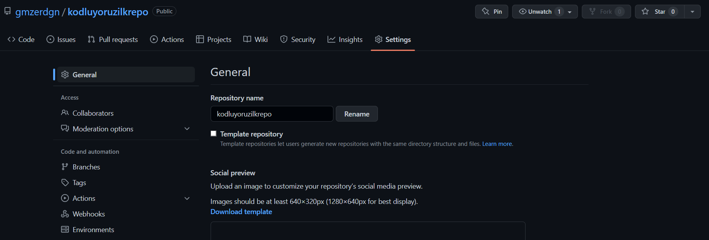

# kodluyoruzilkrepo

Bu repo [Kodluyoruz](https://www.kodluyoruz.org) Front-End Eğitiminde oluşturduğumuz ilk repo. İçerisinde bir adet README dosyası, bir adet de index.html barındırıyor.

## Installation

Öncelikle projeyi clone'layın.

    git clone https://github.com/gmzerdgn/kodluyoruzilkrepo.git

## Usage 

Projeyi clone'ladıktan sonra Visual Studio Code programında açınız.

Linux için:

    cd kodluyoruzilkrepo
    code .  

## Contributing

Pull request'ler kabul edilir. Büyük değişiklikler için, lütfen önce neyi değiştirmek istediğiniz tartışmak için bir konu açınız.

## License

[MIT](https://choosealicense.com)